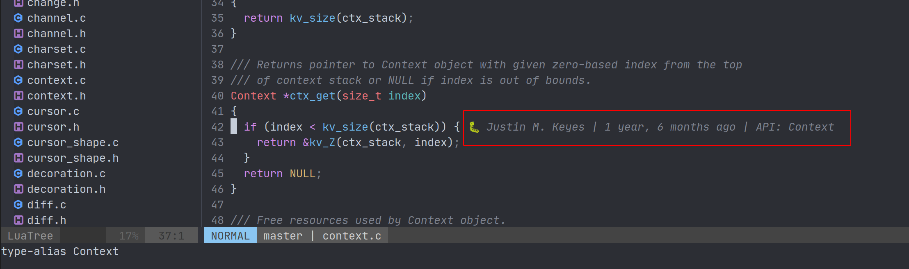

# A git blame plugin for neovim inspired by VS Code's GitLens plugin



## features

- configuable message format
- delay auto hide feature
- dynamic toggle


## usage

just install the plugin and it should works automatically.

for example, use [vim-plug](https://github.com/junegunn/vim-plug)

```vim
Plug 'ttys3/nvim-blamer.lua'

""" must after plugin loaded, for example,
""" if you are using vim-plug, this should put after `call plug#end()`

call nvimblamer#auto()

""" config the plugin
lua <<EOF

require'nvim-blamer'.setup({
    enable = true,
    format = '%committer | %committer-time-human | %summary',
})

EOF

```

## default config

```lua
{
    enable = false,
    prefix = '🐛 ',
    format = '%committer | %committer-time %committer-tz | %summary',
    auto_hide = false,
    hide_delay = 3000,
}
```

## availabe template vars

you can use `filename`, `hash`, `summary`, `committer`, `committer-mail`, `committer-tz`, `committer-time` and `committer-time-human`

```json
{
  "filename": "lua/blamer.lua",
  "hash": "db43ae622dbec1ba3fd8172c2d4fed1b2980c39c",
  "summary": "fix: bypass ft list: rename LuaTree to NvimTree. do not show Not Committed Yet msg",

  "committer": "荒野無燈",
  "committer-mail": "<a@example.com>",
  "committer-tz": "+0800",
  "committer-time": "1610563580",

  "author": "荒野無燈",
  "author-mail": "<a@example.com>",
  "author-time": "1610563580",
  "author-tz": "+0800",
}
```

## available commands

```vim
""" auto show blame info when cursor move
:NvimBlamerAuto

""" toggle blame info display
:NvimBlamerToggle
```

## credits

code mainly from https://www.reddit.com/r/neovim/comments/f1vxhl/replicate_the_basic_functionality_vscodes_gitlens/

https://teukka.tech/vimtip-gitlens.html


## related works

<https://github.com/APZelos/blamer.nvim>

<https://github.com/f-person/git-blame.nvim>

<https://github.com/tveskag/nvim-blame-line>

<https://github.com/zivyangll/git-blame.vim>
